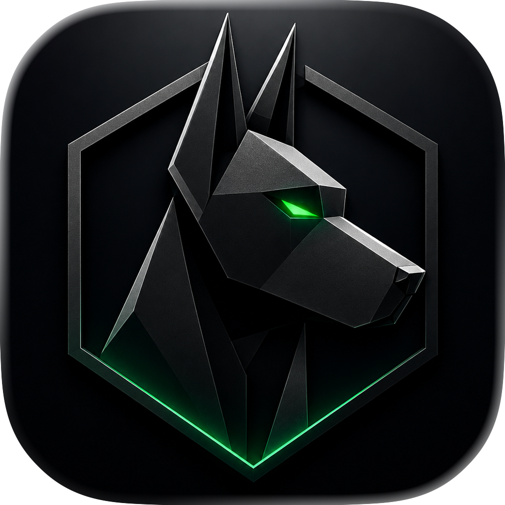

<p align="center">
  
</p>

<h3 align="center">Open-source macOS security suite with on-device AI threat scoring</h3>

<p align="center">
  One app. Six layers of protection. Zero cloud dependency. Read every line of code.
</p>

<p align="center">
  <a href="#features">Features</a> •
  <a href="#architecture">Architecture</a> •
  <a href="#installation">Installation</a> •
  <a href="#building-from-source">Build</a> •
  <a href="#contributing">Contributing</a> •
  <a href="#roadmap">Roadmap</a>
</p>

<p align="center">
  
  
  
  
  
</p>

---

## Why Nick?

macOS ships with solid built-in security — XProtect, Gatekeeper, SIP — but these defenses are signature-based and reactive. They catch known threats after Apple adds a definition. They don't catch:

- **Behavioral threats** — a signed app quietly exfiltrating your keychain
- **Living-off-the-land attacks** — `curl` piping to `bash`, `osascript` running obfuscated scripts
- **Persistence backdoors** — new LaunchAgents installed silently by compromised software
- **Tunnel detection** — reverse shells, unexpected SSH forwarding, SOCKS proxies
- **Zero-day exploits** — novel malware that no signature database has seen yet

Existing tools either cost $60+/year (Norton, Intego), require installing 5-6 separate utilities (Objective-See's excellent but fragmented suite), or are enterprise-only (CrowdStrike, SentinelOne).

**Nick is one app that replaces six tools**, with the only open-source on-device AI behavioral threat scoring engine for macOS. No cloud. No subscription. No trust required — the code is right here.

---

## Features

### 🔍 System Integrity Audit
Continuously verifies your Mac's security posture:
- SIP (System Integrity Protection) status
- FileVault encryption state
- Gatekeeper configuration
- Application Firewall status and rules
- XProtect definition freshness
- TCC database integrity
- `sudo` configuration and PATH integrity

### 🛡️ Persistence Monitor
Watches every known persistence mechanism on macOS and alerts on changes:
- `/Library/LaunchDaemons` and `/Library/LaunchAgents`
- `~/Library/LaunchAgents`
- Login Items
- Cron jobs and periodic scripts
- System Extensions and kernel extensions
- Browser extensions (Safari, Chrome, Firefox)

### 🌐 Network Watchdog
Real-time visibility into what's connecting where:
- Active connections mapped to processes
- Listening port detection (unexpected services)
- Reverse shell detection (shell processes with outbound connections)
- SSH tunnel and port forwarding identification
- DNS query monitoring for known malicious domains
- Unexpected VPN/proxy process detection

### 🔬 Process Auditor
Identifies suspicious runtime behavior:
- Unsigned or ad-hoc signed binaries executing
- Processes running from `/tmp`, `/var/tmp`, or hidden directories
- LOLBin abuse detection (`curl | bash`, `osascript` with obfuscated payloads, `openssl` reverse connections)
- Suspicious parent-child process chains
- Unexpected child processes from GUI apps

### 🧬 YARA Scanner
On-demand and real-time file scanning:
- Embedded YARA engine (libyara) with curated macOS-specific rule set
- Community-contributed rules via pull requests
- Scheduled scans of critical directories
- Drag-and-drop scanning of any file or folder
- Heuristic analysis: entropy scoring, Mach-O header inspection, embedded URL/IP extraction

### 📷 Camera & Microphone Sentinel
Detects unauthorized access to your camera and microphone in real time:
- Monitors all CoreMediaIO video devices for unexpected activation
- Monitors CoreAudio input devices for unsanctioned recording
- Attributes device activation to the most-recently-launched non-system process
- Elevates severity to high when an unsigned binary is found accessing media hardware
- Baseline-delta approach: only alerts on new activations, not ongoing expected usage

### 🧠 AI Behavioral Scoring (The Differentiator)
On-device CoreML pipeline for behavioral threat correlation. v0.9 ships with rule-based scoring; the ML model activates once trained on real-world signal data.
- Individual signals are noisy. Correlated signals are actionable.
- `curl` downloading a binary to `/tmp` = medium risk
- That binary executing unsigned 2 seconds later = high risk
- That binary opening an outbound connection to a raw IP on port 443 = critical
- Natural-language alert explanations powered by on-device Foundation Models (macOS 26+)
- No data ever leaves your Mac

---

## Architecture

```
┌─────────────────────────────────────────────┐
│              Nick.app (SwiftUI)              │
│         Menu Bar + Dashboard + Alerts        │
├─────────────────────────────────────────────┤
│             Threat Correlator                │
│    Combines signals → CoreML threat score    │
├──────────┬──────────┬───────────┬───────────┤
│ Process  │ Persist- │ Network   │ File      │
│ Auditor  │ ence     │ Watchdog  │ System    │
│          │ Monitor  │           │ Watcher   │
├──────────┴──────────┴───────────┴───────────┤
│              YARA Engine (libyara)           │
│         + Heuristic Analysis Layer           │
├─────────────────────────────────────────────┤
│         AI Behavioral Scorer (CoreML)        │
├─────────────────────────────────────────────┤
│          Privileged Helper (XPC)             │
│     SMAppService · Elevated Operations       │
└─────────────────────────────────────────────┘
```

### Project Structure

```
Nick/
├── Core/                        # Detection engine (pure Swift, no UI dependency)
│   ├── AVCapture/               # Camera and microphone activity monitoring
│   ├── BehavioralScorer/        # CoreML inference engine
│   ├── DeepScan/                # Full-system YARA deep scan driver
│   ├── Helper/                  # Privileged helper client interface
│   ├── Models/                  # Core-layer model types
│   ├── NetworkAnalyzer/         # Connection monitoring and tunnel detection
│   ├── Notifications/           # NotificationManager
│   ├── PersistenceWatcher/      # LaunchAgent/Daemon/Login Item surveillance
│   ├── ProcessMonitor/          # Process auditing and anomaly detection
│   ├── Protocols/               # Shared monitor protocol definitions
│   ├── Services/                # macOS Services menu provider
│   ├── Settings/                # AppSettings
│   ├── SystemAudit/             # SIP, FileVault, Gatekeeper, firewall checks
│   ├── ThreatCorrelator/        # Multi-signal correlation and scoring
│   ├── ThreatLog/               # Persistent threat log
│   ├── YARAEngine/              # C interop wrapper for libyara + FSEvents watcher
│   ├── SecurityEngine.swift     # Top-level observable state model
│   └── MonitorCoordinator.swift # Lifecycle orchestration for all monitors
│
├── App/                         # SwiftUI macOS application
│   ├── Dashboard/               # Overview, scanner, deep scan, network, and alert views
│   ├── Alerts/                  # Threat log export and history
│   ├── Settings/                # Settings view
│   ├── SystemAudit/             # System audit view
│   ├── Theme/                   # Design tokens (colors, typography, spacing, layout)
│   ├── MainWindowView.swift     # NavigationSplitView shell and sidebar
│   ├── NickApp.swift            # @main entry point
│   └── AppDelegate.swift        # NSStatusItem and engine bootstrap
│
├── NickHelper/                  # Privileged helper tool (XPC + SMAppService)
│
├── Models/                      # Shared Swift model types
│   └── Training/                # CoreML training pipeline (Python)
│
├── Rules/                       # YARA rule sets
│   └── community/               # Community-contributed rules
│
└── Tests/
    ├── NickTests/               # Unit tests
    └── NickIntegrationTests/    # End-to-end detection tests
```

---

## Installation

### Requirements
- macOS 26 or later (required by the YARA static library)
- Apple Silicon or Intel Mac

### Download
Download the latest notarized `.dmg` from [Releases](https://github.com/EhsanAzish80/Nick/releases).

### Homebrew (coming soon)
```bash
brew install --cask nick-security
```

### Permissions
Nick requires the following permissions to function (each is requested individually with an explanation):

| Permission | Why |
|---|---|
| **Full Disk Access** | Monitor LaunchAgents, browser extensions, and system directories |
| **Network Monitoring** | Detect suspicious connections and tunnels |
| **Camera & Microphone** | Detect unauthorized access to media hardware |
| **Accessibility** | Detect UI-level process manipulation (optional) |
| **Notifications** | Alert you when threats are detected |

Nick never accesses your documents, photos, or personal files. Monitoring is limited to system directories, process tables, and network state.

---

## Building from Source

```bash
## Clone
git clone https://github.com/EhsanAzish80/Nick.git
cd Nick

## Open in Xcode (requires Xcode 16+)
open Nick.xcodeproj

## Build
xcodebuild -scheme Nick -configuration Release

## Run tests
xcodebuild test -scheme NickTests -destination "platform=macOS"

## Build unsigned (no signing team required)
xcodebuild -scheme Nick CODE_SIGN_IDENTITY="" CODE_SIGNING_REQUIRED=NO CODE_SIGNING_ALLOWED=NO
```

> The checked-in project uses the maintainer's signing team. Override with your own team in Xcode → Signing & Capabilities, or build unsigned using the command above.

### Dependencies
Nick uses zero third-party Swift dependencies. The only external dependency is `libyara` (C library, vendored).

- **UI**: SwiftUI (Apple framework)
- **Persistence detection**: FSEvents, Foundation (Apple frameworks)
- **Network monitoring**: Network.framework, `sysctl` (Apple frameworks / POSIX)
- **Process auditing**: `proc_info`, `sysctl` (POSIX)
- **Scanning**: libyara (vendored, BSD license)
- **AI scoring**: CoreML, Foundation Models (Apple frameworks)
- **Privileged helper**: SMAppService, XPC (Apple frameworks)

---

## How Nick Compares

| Capability | Nick | Objective-See (6 tools) | Little Snitch | Intego | Norton |
|---|:---:|:---:|:---:|:---:|:---:|
| Process monitoring | ✅ | ✅ (BlockBlock + KnockKnock) | ❌ | ❌ | ✅ |
| Persistence detection | ✅ | ✅ (BlockBlock) | ❌ | ❌ | ✅ |
| Network monitoring | ✅ | ✅ (LuLu) | ✅ | ✅ (NetBarrier) | ✅ |
| Webcam/mic monitoring | ✅ | ✅ (OverSight) | ❌ | ❌ | ✅ |
| YARA scanning | ✅ | ❌ | ❌ | ✅ | ✅ |
| Behavioral AI scoring | ✅ | ❌ | ❌ | ❌ | ❌ |
| Correlated threat detection | ✅ | ❌ | ❌ | ❌ | ❌ |
| System hardening audit | ✅ | ❌ | ❌ | ❌ | ❌ |
| Open source | ✅ | ✅ | ❌ | ❌ | ❌ |
| No cloud dependency | ✅ | ✅ | ✅ | ❌ | ❌ |
| Single app | ✅ | ❌ (6 separate apps) | ✅ | ✅ | ✅ |
| Free | ✅ | ✅ | ❌ ($59) | ❌ ($40-70/yr) | ❌ ($40-80/yr) |

---

## Roadmap

### v0.1 — Foundation ✅ Complete
- [x] System integrity audit (SIP, FileVault, Gatekeeper, firewall, XProtect)
- [x] LaunchAgent/Daemon monitoring with change detection
- [x] Process auditor (unsigned binaries, suspicious locations, parent-child chains)
- [x] Network connection viewer with process mapping
- [x] SwiftUI menu bar app with dashboard

### v0.5 — Active Detection ✅ Complete
- [x] FSEvents watcher on critical directories
- [x] YARA engine integration with curated rule set
- [x] On-demand file/directory scanner
- [x] Heuristic analysis (entropy, code signing, Mach-O inspection)
- [x] Real-time notification system
- [x] Privileged helper for elevated operations

### v0.9 — AI Behavioral Scoring ✅ Complete
- [x] Threat correlation engine (multi-signal scoring)
- [x] CoreML behavioral scoring model
  > CoreML pipeline implemented and tested; shipping with rule-based scoring until trained model replaces stub
- [x] Foundation Models alert explanations (macOS 26+)
- [x] Real-time behavioral monitoring
- [x] Threat log with forensic detail
- [x] Camera and microphone activity monitoring (AVCaptureMonitor)

### v1.0 — Public Release (In Progress)
- [ ] Third-party security audit of privileged helper and detection engine
- [ ] False positive tuning across diverse Mac configurations
- [ ] Performance optimization (< 1% CPU, < 50MB RAM)
- [ ] Homebrew cask distribution
- [ ] Comprehensive documentation

### Future
- [ ] DNS-over-HTTPS tunnel detection
- [ ] Community rule marketplace
- [ ] Automated incident response actions
- [ ] Enterprise deployment support

---

## Contributing

We welcome contributions! See [CONTRIBUTING.md](CONTRIBUTING.md) for guidelines.

**Ways to contribute:**
- 🐛 Report bugs and false positives
- 🧬 Submit YARA rules for macOS-specific threats
- 🧠 Improve the behavioral scoring model
- 📖 Improve documentation
- 🔍 Security audit and responsible disclosure (see [SECURITY.md](SECURITY.md))
- 🧪 Test on different Mac configurations

---

## Security

Nick is a security tool — we hold ourselves to a higher standard. If you discover a vulnerability in Nick itself, please follow our [responsible disclosure process](SECURITY.md). Do **not** open a public issue for security vulnerabilities.

---

## Uninstalling

1. Quit Nick from the menu bar icon → **Quit Nick**.
2. Open **Nick → Settings → Maintenance** and click **Remove Helper…** to unregister the privileged helper.
3. Drag `Nick.app` from `/Applications` to the Trash.
4. Remove preferences and data:
   ```bash
   defaults delete com.ehsanazish.nick
   rm -rf ~/Library/Application\ Support/Nick
   rm -f ~/Library/LaunchAgents/com.ehsanazish.nick.plist
   sudo rm -f /Library/LaunchDaemons/com.ehsanazish.nick.helper.plist
   sudo rm -f /Library/PrivilegedHelperTools/com.ehsanazish.nick.helper
   ```

---

## Philosophy

1. **No cloud, ever.** All scanning, analysis, and AI inference happens on your Mac. Your security data never leaves your machine.
2. **Zero third-party Swift dependencies.** Every dependency is an attack surface. Nick uses Apple frameworks and a single vendored C library (libyara).
3. **Transparency over trust.** You shouldn't trust any security tool blindly. Read the code. Audit the helper. Verify the signatures.
4. **Signals over alerts.** Individual events are noisy. Correlated behavioral scoring reduces false positives and surfaces real threats.
5. **Restraint over decoration.** Clean, native macOS interface. No scare tactics. No upsells. No dark patterns.

---

## License

Nick is licensed under the [GNU Affero General Public License v3.0](LICENSE).

This means you can freely use, modify, and distribute Nick. If you run a modified version as a network service, you must make your source code available. This ensures the security community always has access to the detection logic.

---

## Acknowledgments

Nick stands on the shoulders of:
- [Patrick Wardle](https://objective-see.org) and the Objective-See Foundation — for pioneering open-source macOS security
- [YARA](https://virustotal.github.io/yara/) — the pattern matching engine that powers malware research worldwide
- The macOS security research community — for continuously uncovering and documenting threats

---

<p align="center">
  Built by Ehsan Azish at <a href="https://3nsofts.com">3nsofts</a> · Crafted with Swift · Protected by the community
</p>
